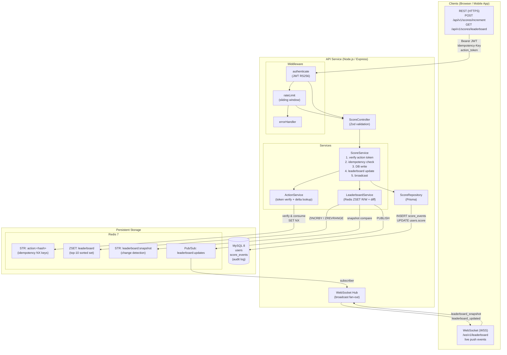
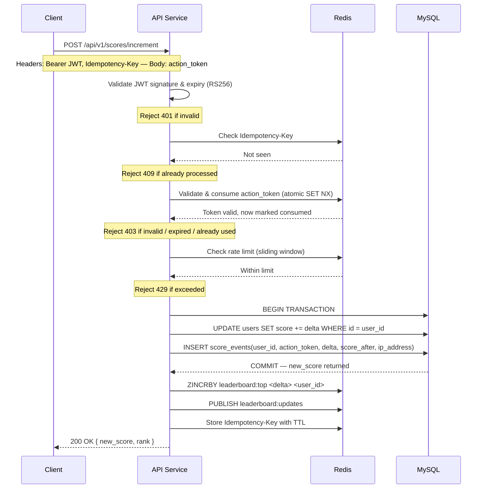
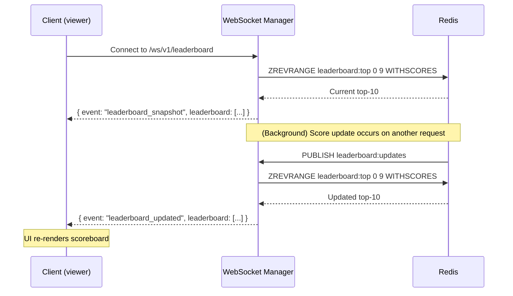
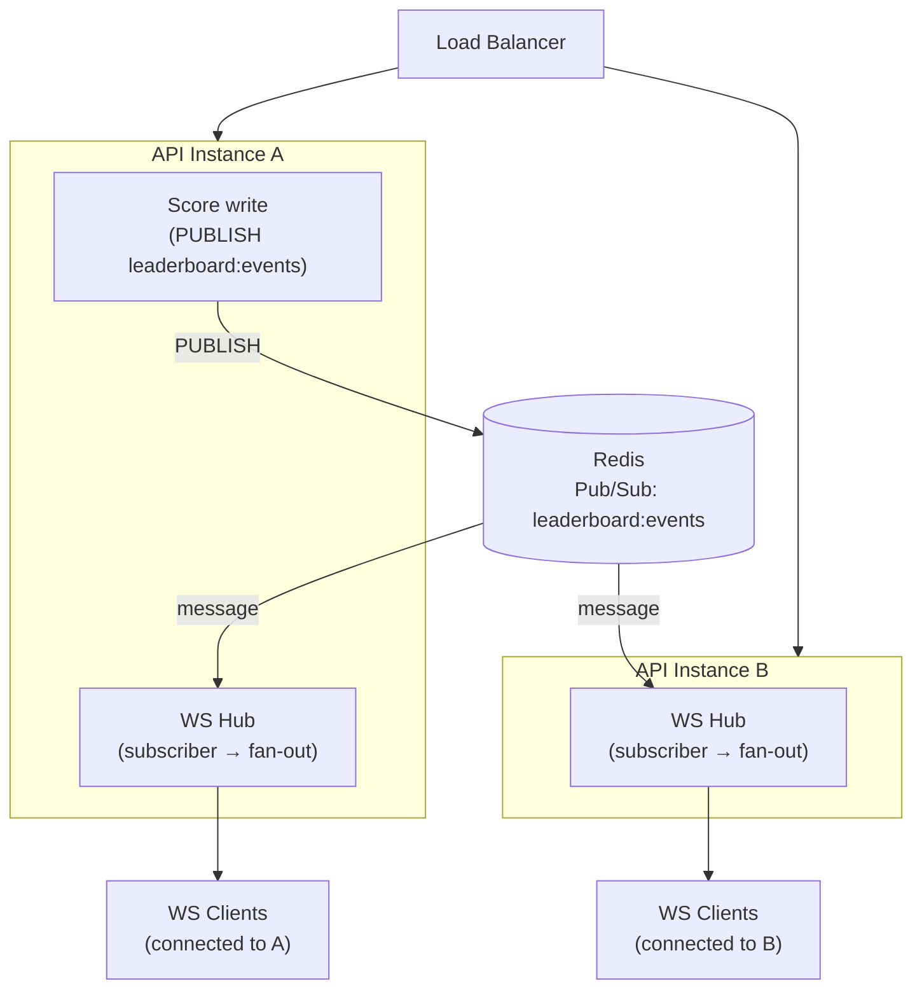

# Problem 6 — Live Scoreboard Module Specification

## Overview

This document specifies the **Score Update Module** for the backend API service. It covers the REST and WebSocket interfaces, authorization model, data flow, and project structure for the engineering team to implement.

**Responsibilities of this module:**
- Accept authenticated score-increment requests from clients
- Prevent unauthorized or replayed score submissions
- Maintain a real-time top-10 leaderboard
- Broadcast live leaderboard updates to all connected clients

---

## Tech Stack

| Layer | Technology |
|---|---|
| Runtime | Node.js 18+, TypeScript |
| Framework | Express.js |
| ORM | Prisma |
| Database | MySQL 8 |
| Cache / Leaderboard | Redis 7 (sorted set + pub/sub) |
| Real-time | WebSocket (`ws` library) |
| Auth | JWT (jsonwebtoken) |
| Validation | Zod |
| Container | Docker + Docker Compose |

---

## Project Structure

```
src/problem6/
├── prisma/
│   ├── schema.prisma          # DB schema: User, ScoreEvent
│   └── seed.ts                # Seed data for local development
│
├── src/
│   ├── server.ts              # Entry point — HTTP + WebSocket server bootstrap
│   ├── app.ts                 # Express app factory, middleware registration
│   │
│   ├── config/
│   │   ├── env.ts             # Typed environment variable loader (dotenv + Zod)
│   │   └── redis.ts           # Redis client singleton (ioredis)
│   │
│   ├── middleware/
│   │   ├── authenticate.ts    # JWT verification — attaches req.userId
│   │   ├── rateLimit.ts       # Per-user sliding-window rate limiter (Redis)
│   │   └── errorHandler.ts    # Global Express error handler
│   │
│   ├── models/
│   │   └── score.model.ts     # Zod schemas for request/response validation
│   │
│   ├── controllers/
│   │   └── score.controller.ts # Route handlers — parse, validate, delegate to service
│   │
│   ├── services/
│   │   ├── score.service.ts   # Orchestrates: verify action → idempotency → write → broadcast
│   │   ├── action.service.ts  # Validates action_id signature, looks up point delta
│   │   └── leaderboard.service.ts # Redis ZSET reads/writes, change detection
│   │
│   ├── repositories/
│   │   └── score.repository.ts # Prisma queries: insert ScoreEvent, update User.score
│   │
│   ├── websocket/
│   │   └── hub.ts             # WebSocket server, client registry, broadcast fan-out
│   │
│   ├── routes/
│   │   └── score.routes.ts    # Express router: POST /increment, GET /leaderboard
│   │
│   └── errors/
│       └── AppError.ts        # Typed error classes (Unauthorized, Conflict, etc.)
│
├── docker-compose.yml         # API + MySQL + Redis
├── Dockerfile
├── package.json
└── tsconfig.json
```

---

## API Reference

### `POST /api/v1/scores/increment`

Increment the authenticated user's score upon completing an action.

**Request Headers**

| Header | Required | Description |
|---|---|---|
| `Authorization` | Yes | `Bearer <JWT access token>` |
| `Content-Type` | Yes | `application/json` |
| `Idempotency-Key` | Yes | UUID v4 — guards against duplicate submissions on network retry |

**Request Body:**
```json
{
  "action_token": "string"
}
```

**Success — `200 OK`:**
```json
{
  "new_score": 1250,
  "rank": 3
}
```

**Error Responses:**

| Status | Code | Reason |
|---|---|---|
| `401` | `UNAUTHORIZED` | Missing or invalid JWT |
| `403` | `FORBIDDEN` | Action token invalid, expired, or issued to a different user |
| `409` | `DUPLICATE_REQUEST` | `Idempotency-Key` already processed |
| `429` | `RATE_LIMITED` | Too many score updates from this user |
| `500` | `INTERNAL_ERROR` | Server-side failure |

---

### `GET /api/v1/scores/leaderboard`

Returns the current top-10 snapshot. Used for initial page load; subsequent updates arrive via WebSocket.

**Auth:** None

**Response — `200 OK`:**
```json
{
  "leaderboard": [
    { "rank": 1, "user_id": "u_abc", "display_name": "Alice", "score": 5400 },
    { "rank": 2, "user_id": "u_xyz", "display_name": "Bob",   "score": 4900 }
  ],
  "updated_at": "2026-04-06T12:00:00Z"
}
```

---

### `WebSocket /ws/v1/leaderboard`

Persistent connection for real-time leaderboard pushes.

**On connect** — server immediately sends the current top-10:
```json
{
  "event": "leaderboard_snapshot",
  "leaderboard": [ ... ]
}
```

**On change** — server pushes a full replacement list:
```json
{
  "event": "leaderboard_updated",
  "leaderboard": [ ... ]
}
```

> Clients replace their local state on each event (no partial patching).

---

## Authorization & Security

### 1. JWT Authentication

- Every score-increment request must carry a signed JWT issued by the Auth Service.
- **RS256 (asymmetric) is recommended** over HS256 — the API service only needs the public key to verify tokens, avoiding shared-secret distribution across services.
- Short-lived tokens (15-minute TTL recommended).
- JWT claims used: `sub` (user ID), `exp`, `iat`.
- The `sub` claim is the only accepted user identity — the request body must **not** contain a `user_id` field, preventing users from submitting scores on behalf of others.

### 2. Action Tokens

Action tokens decouple "the server knows this action started" from "the client says the action finished". Flow:

1. When the user begins an action, the client requests an **action token** from the server (endpoint owned by the action feature team — see [Improvement #1](#1-action-token-endpoint-ownership)).
2. The server creates a signed, single-use JWT (short TTL — 60 seconds recommended) bound to `user_id` and `action_type`, and stores its hash in Redis.
3. Upon action completion, the client submits this token to `POST /api/v1/scores/increment`.
4. The Score Service verifies the signature, checks expiry, and atomically marks it consumed in Redis to prevent replay.

This means a score increase can only occur if the server itself previously acknowledged the action — clients cannot fabricate score increments.

> **Note for implementors:** The action token endpoint is owned by a separate team. Coordinate on token format (suggested: JWT signed with the same RS256 key pair) and Redis key namespacing to avoid collisions.

### 3. Idempotency (Two Layers)

**Layer 1 — `Idempotency-Key` header:** Cached in Redis with TTL matching the action token TTL. Guards against network retries submitting the same request twice. Returns `409` if the key was already processed.

**Layer 2 — Action token single-use:** After the idempotency check, the action token is atomically consumed in Redis (`SET NX action:<token_hash>`). A unique index on `score_events.action_token` in MySQL acts as a final safety net.

### 4. Rate Limiting

- Sliding window: **10 requests per user per minute** enforced via Redis.
- Exceeds limit → `429` (window details not disclosed to prevent gaming).

### 5. Server-Side Delta

The point value for an action is **never supplied by the client**. It is looked up from an internal `ActionRegistry` map keyed by action type. Clients have no way to influence the delta.

---

## Data Model

### `User` (existing table)

| Column | Type | Notes |
|---|---|---|
| `id` | UUID | Primary key |
| `display_name` | VARCHAR | |
| `score` | BIGINT | Aggregate score, default `0` |

### `ScoreEvent` (new table)

| Column | Type | Notes |
|---|---|---|
| `id` | UUID | Primary key |
| `user_id` | UUID | FK → User |
| `action_token` | VARCHAR | Hashed token — unique index enforces idempotency at DB level |
| `delta` | INT | Points awarded |
| `score_after` | BIGINT | Snapshot of user's score post-update — enables timeline reconstruction without replaying all deltas |
| `ip_address` | VARCHAR | Client IP — for post-hoc fraud investigation |
| `created_at` | TIMESTAMP | |

### Redis Leaderboard (Sorted Set)

Key: `leaderboard`

- Write: `ZINCRBY leaderboard <delta> <user_id>`
- Read top-10: `ZREVRANGE leaderboard 0 9 WITHSCORES`
- Snapshot comparison stored at: `leaderboard:snapshot` (JSON string, updated after each broadcast)

---

## Architecture Diagram



---

## Execution Flow (Sequence)

### Score Update Flow

When a user completes an action, the client submits a score update request. The API applies layered defences before touching the database: it first verifies the JWT identity, then checks the `Idempotency-Key` to guard against network retries, then atomically validates and consumes the single-use action token to prevent replays, and finally enforces a per-user rate limit. Only after all four gates pass does the service open a database transaction to increment the score and write the audit record. On commit, it updates the Redis leaderboard sorted set and publishes a broadcast event — keeping the HTTP response and the real-time fan-out decoupled.



---

### Live Leaderboard Broadcast Flow

Connected clients never poll — they receive leaderboard updates passively via WebSocket. When a score update is committed, the Score Service publishes a message to a Redis Pub/Sub channel. The WebSocket Manager (running on every API instance) is subscribed to that channel; on receiving the event it fetches the current top-10 from the Redis Sorted Set and immediately broadcasts it to all connected clients. This design means the broadcast fan-out is completely decoupled from the HTTP request path and works correctly across multiple horizontally-scaled instances without sticky sessions.



---

## Horizontal Scaling

When running multiple API instances behind a load balancer, WebSocket clients may be connected to different instances. Use **Redis Pub/Sub** as the broadcast bus:



Each instance subscribes to `leaderboard:events` on startup and forwards any received message to its locally connected WebSocket clients.

---

## Observability

Instrument the following metrics from day one:

| Metric | Labels | Purpose |
|---|---|---|
| `score_update_requests_total` | `outcome`: success, invalid_token, rate_limited, duplicate | Track success/failure rates and attack patterns |
| `leaderboard_broadcast_latency_ms` | — | Time from DB write to WebSocket push — detect Redis lag |
| `active_websocket_connections` | — | Capacity planning and connection leak detection |

---

## Suggested Improvements

### 1. Action Token Endpoint Ownership
The score module assumes action tokens are issued by a separate endpoint (owned by the action feature team). Coordinate on: token format (suggested: JWT signed with the same RS256 key pair), Redis key schema for consumed tokens (avoid namespace collisions), and TTL values.

### 2. Score Delta Configuration
Score increments are defined server-side per `action_type`. Store these in a config table or environment-backed config map rather than hardcoding, so point values can be adjusted without a deployment.

### 3. Score Velocity Anomaly Alerts
Flag users whose score rate exceeds statistical norms (e.g. >3σ per hour); route alerts to an ops channel for manual review.

### 4. WebSocket Authentication
The current spec does not require auth for the WebSocket connection since the leaderboard is public. If user-specific data is added (e.g. highlighting the connected user's own rank), add JWT validation to the WebSocket handshake via a query parameter or `Sec-WebSocket-Protocol` header.

### 5. Graceful Redis Degradation
If Redis is unavailable, fall back to a DB query for the leaderboard and skip real-time broadcast until Redis is restored. Log and alert on the degraded state.

### 6. Leaderboard Consistency Reconciliation
Redis and MySQL are updated in sequence, not atomically. If the server crashes between the DB write and the Redis update, the leaderboard cache will be stale. Add a periodic background job (e.g. every 30s) that reconciles the Redis sorted set from the database as a safety net.

### 7. Action Token Timing Attack
Even with single-use tokens, a token submitted suspiciously fast after issuance could indicate scripted behavior (e.g. a bot capturing the token before a real user interaction). For high-value actions, add a server-side timing check and reduce action token TTL aggressively (10–30 seconds).

### 8. Horizontal Scaling
The Redis Pub/Sub approach handles multi-instance deployments correctly. Ensure WebSocket sessions are not load-balanced with sticky sessions — the pub/sub fan-out is the correct scaling primitive, not session affinity.
